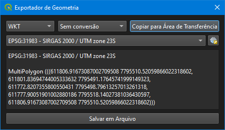

# Geometry Exporter

[](https://qgis.org)
[](https://opensource.org/licenses/MIT)

A QGIS plugin that exports and displays the geometry of selected features in various text formats and spatial files.

This project is a **translated and expanded fork** of the original plugin [qgis-geometry-exporter-plugin](https://github.com/JuergenWeichand/qgis-geometry-exporter-plugin), developed by [Juergen Weichand](https://github.com/JuergenWeichand).

## 📋 Features

- **Geometry Visualization**: Displays the geometry of the selected feature as text.
- **Supported Text Formats**:
  - WKT (Well-Known Text)
  - EWKT (Extended Well-Known Text)
  - GeoJSON
  - GML 2
  - GML 3
  - KML
  - GeoHash
- **Export to Spatial Files**:
  - GeoPackage (`.gpkg`)
  - ESRI Shapefile (`.shp`)
  - KML (`.kml`)
  - GeoJSON (`.geojson`)
  - GML (`.gml`)
- **Ad Hoc Conversions**:
  - Envelope (Bounding Box)
  - Centroid
  - Convex Hull
  - Boundary
- **CRS Transformation**: Change the Coordinate Reference System (CRS) of the geometry before export.
- **Quick Copy**: Copy the result to the clipboard with one click.
- **File Saving**: Save the geometry directly to spatial or text files.
- **Multilingual Interface**: Portuguese (Brazil), English, and Spanish.
- **Compatibility**: Works on QGIS 3.x (Qt5/PyQt5) and QGIS 4.x (Qt6/PyQt6).

## 🌐 Supported Languages

The plugin automatically detects the language configured in QGIS. The following languages are available:

| Language | Code | Translation |
|----------|------|-------------|
| Portuguese (Brazil) | `pt` | ✅ Complete |
| English | `en` | ✅ Complete |
| Spanish | `es` | ✅ Complete |

Translation is handled by the `i18n.py` file, which contains an internal dictionary with all plugin texts. To add a new language, simply add a new entry to the `TRANSLATIONS` dictionary.

## 🖥️ Interface

Geometry Exporter Tool User Interface



## 🚀 Installation

### Method 1: Installation via QGIS (Recommended)
1. Open QGIS.
2. Go to **Plugins** → **Manage and Install Plugins**.
3. In the **Settings** tab, make sure "Show experimental plugins" is checked (if needed).
4. In the **All** tab, search for "Geometry Exporter".
5. Select the plugin and click **Install Plugin**.

### Method 2: Manual Installation
1. Download the plugin `.zip` file.
2. Extract the contents to the QGIS plugins folder:
   - **Windows**: `C:\Users\<YourUser>\AppData\Roaming\QGIS\QGIS3\profiles\default\python\plugins\`
   - **Linux**: `~/.local/share/QGIS/QGIS3/profiles/default/python/plugins/`
   - **macOS**: `~/Library/Application Support/QGIS/QGIS3/profiles/default/python/plugins/`
3. Restart QGIS.
4. Enable the plugin in **Plugins** → **Manage and Install Plugins** → **Installed**.

## 🛠️ Usage

1. Select a vector layer in QGIS.
2. Select **exactly one feature** on the layer.
3. Click the plugin icon in the toolbar or go to **Vector** → **Geometry Exporter**.
4. In the plugin window:
   - Choose the **export format** (WKT, GeoJSON, etc.).
   - Choose the desired **conversion** (optional).
   - Change the **CRS** if necessary.
   - View the result in the text area.
   - Use **Copy to Clipboard** or **Save to File**.

## 📦 Project Structure

```
GeometryExporter/
├── README.md                          # This file
├── LICENSE                            # MIT License
├── .gitignore                         # Git ignore rules
└── geometry_exporter/                 # Plugin package (contents of the .zip)
    ├── __init__.py                    # Initialization and classFactory
    ├── i18n.py                        # Translation dictionary (pt-BR/en/es)
    ├── geometry_exporter.py           # Main plugin logic
    ├── geometry_exporter_dialog.py    # Dialog (with i18n support)
    ├── geometry_exporter_dialog_base.ui  # Dialog interface (Qt Designer)
    ├── metadata.txt                   # Plugin metadata for QGIS
    ├── changelog                      # Version history
    ├── geometry_exporter.svg          # Plugin icon (SVG)
    ├── geometry_exporter_help.svg     # Help icon (SVG)
    └── help/
        ├── index.html                 # Help documentation
        ├── lang.js                    # Help translations
        ├── style.css                  # Help stylesheet
        └── image_01.png               # Help image
```

## 🔧 Technical Details

### Internationalization Architecture

The plugin uses a **Python dictionary-based** approach (`i18n.py`) instead of Qt `.qm` files. Advantages:

- **No external tool dependency** (Qt Linguist, `lrelease`).
- **Easy to maintain**: adding a language only requires editing the dictionary.
- **Automatic detection**: uses QGIS's `QSettings().value('locale/userLocale')`.
- **Safe fallback**: if the language is not supported, it falls back to English.

### QGIS 3.x and 4.x Compatibility

- **Imports**: all via `qgis.PyQt.*` (works on both PyQt5 and PyQt6).
- **Message levels**: uses fallback to `Qgis.MessageLevel.Success` (QGIS 3.40+) or `Qgis.Success` (earlier versions).
- **File writing**: uses `QgsVectorFileWriter.writeAsVectorFormatV3()` (modern API).

### Language Testing (Developers)

To test a specific language without changing QGIS settings, edit `__init__.py`:

```python
FORCED_LOCALE = 'en'    # Test English
# FORCED_LOCALE = 'es'  # Test Spanish
# FORCED_LOCALE = 'pt'  # Test Portuguese
# FORCED_LOCALE = None  # Automatic (production)
```

Restart QGIS between each test.

## 📜 History

This project is based on the original plugin [qgis-geometry-exporter-plugin](https://github.com/JuergenWeichand/qgis-geometry-exporter-plugin), created by **Juergen Weichand** in 2015. The fork was made to:

- Add complete translation for **Portuguese (Brazil)**, **English**, and **Spanish**.
- Include export to **GeoPackage** and **ESRI Shapefile**.
- Add **GeoHash** support.
- Implement direct file saving.
- Ensure compatibility with **QGIS 3.x** and **QGIS 4.x**.
- Remove dependency on `resources.py` (was based on PyQt4, incompatible with QGIS 3+).

## 🤝 Contributing

Contributions are welcome! Feel free to open issues or submit pull requests.

1. Fork the project.
2. Create a branch for your feature (`git checkout -b feature/new-feature`).
3. Commit your changes (`git commit -am 'Add new feature'`).
4. Push to the branch (`git push origin feature/new-feature`).
5. Open a Pull Request.

### How to Add a New Language

1. Open the `i18n.py` file.
2. Add a new entry to `TRANSLATIONS` with the language code (e.g., `'fr'` for French).
3. Copy all existing keys and translate the values.
4. Restart QGIS with the language configured.

## 📄 License

This project is licensed under the **MIT License**. See the [LICENSE](LICENSE) file for more details.

```
MIT License

Copyright (c) 2015 Juergen Weichand
Copyright (c) 2026 Ezequiel M Rezende

Permission is hereby granted, free of charge, to any person obtaining a copy
of this software and associated documentation files (the "Software"), to deal
in the Software without restriction, including without limitation the rights
to use, copy, modify, merge, publish, distribute, sublicense, and/or sell
copies of the Software, and to permit persons to whom the Software is
furnished to do so, subject to the following conditions:

The above copyright notice and this permission notice shall be included in all
copies or substantial portions of the Software.

THE SOFTWARE IS PROVIDED "AS IS", WITHOUT WARRANTY OF ANY KIND, EXPRESS OR
IMPLIED, INCLUDING BUT NOT LIMITED TO THE WARRANTIES OF MERCHANTABILITY,
FITNESS FOR A PARTICULAR PURPOSE AND NONINFRINGEMENT. IN NO EVENT SHALL THE
AUTHORS OR COPYRIGHT HOLDERS BE LIABLE FOR ANY CLAIM, DAMAGES OR OTHER
LIABILITY, WHETHER IN AN ACTION OF CONTRACT, TORT OR OTHERWISE, ARISING FROM,
OUT OF OR IN CONNECTION WITH THE SOFTWARE OR THE USE OR OTHER DEALINGS IN THE
SOFTWARE.
```

## 👥 Authors

- **Original**: Juergen Weichand ([juergen@weichand.de](mailto:juergen@weichand.de))
- **Modified by**: Ezequiel M Rezende ([emrezende@gmail.com](mailto:emrezende@gmail.com))

## 🔗 Links

- **Original Repository**: [https://github.com/JuergenWeichand/qgis-geometry-exporter-plugin](https://github.com/JuergenWeichand/qgis-geometry-exporter-plugin)
- **This Fork's Repository**: [https://github.com/em-rezende/qgis-geometry-exporter-plugin](https://github.com/em-rezende/qgis-geometry-exporter-plugin)
- **Issues**: [https://github.com/em-rezende/qgis-geometry-exporter-plugin/issues](https://github.com/em-rezende/qgis-geometry-exporter-plugin/issues)
- **Homepage**: [https://em-rezende.github.io/](https://em-rezende.github.io/)

---

**Note**: This plugin is compatible with QGIS 3.0 through 4.99.
